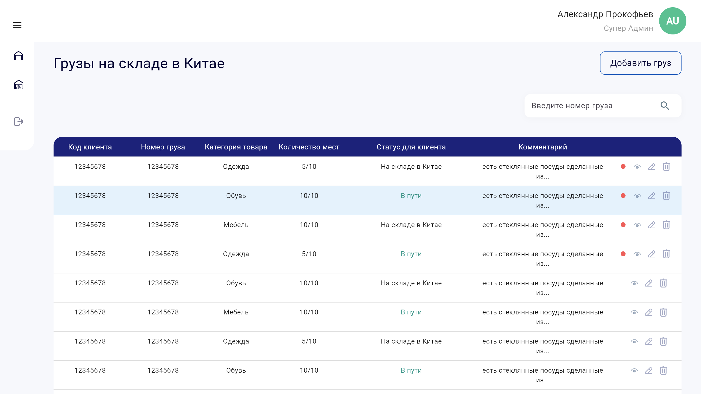

# Cargo Dashboard Flutter Project

This project is a Flutter-based dashboard for managing cargo operations. It includes a responsive sidebar with expandable menus, animated transitions, and a main content area that displays tables, search components, or other management widgets.

[]()



## Features

- **Responsive Sidebar**  
  - Expandable menus (e.g. "Грузы", "Посылки")  
  - Animated size changes using `AnimatedSize`  
  - Selected menu item styling with bold text and gradient border

- **Main Content Area**  
  - Includes header with user account info and toggle button  
  - Displays tables, search, or other content (implemented in `Maincontent` widget)

- **Animations and Visual Effects**  
  - Smooth transitions for sidebar expansion/collapse  
  - Custom box shadows and gradient borders to enhance UI

## Technologies and Libraries

- **Flutter** – UI toolkit for building mobile applications.  
- **Dart** – Programming language used by Flutter.  
- Flutter Material widgets (e.g. `Scaffold`, `AnimatedContainer`, `ListTile`, `CircleAvatar`).

## Project Structure

```
/cargo_dashboard
├── lib
│   ├── screens
│   │   ├── home_screen.dart       // Main screen with sidebar and content area.
│   │   ├── sidebar.dart           // Sidebar widget with expandable menus.
│   │   └── Maincontent.dart       // Widget to show main dashboard content.
│   ├── utils
│   │   └── appcolors.dart         // Contains color definitions used throughout the app.
│   └── main.dart                  // Application entry point.
├── pubspec.yaml                   // Project dependencies and configuration.
└── README.md                      // Documentation (this file).
```

## Getting Started

### Prerequisites

- [Flutter SDK](https://flutter.dev/docs/get-started/install) installed.
- A code editor like [VS Code](https://code.visualstudio.com/) or Android Studio.
- An emulator or physical device for running the app.

### Installation

1. **Clone the repository:**

   ```bash
   git clone https://github.com/yourusername/cargo_dashboard.git
   cd cargo_dashboard
   ```

2. **Get the dependencies:**

   ```bash
   flutter pub get
   ```

3. **Run the App:**

   To run on an emulator or connected device, use:

   ```bash
   flutter run
   ```

   Or, open the project in your editor and run using the inbuilt debugger.

## How It Works

- **Home Screen (`home_screen.dart`):**  
  The main screen uses a `Row` to display the sidebar and the content area. The sidebar is wrapped in an `AnimatedContainer` whose width toggles between `expanded` and `collapsed` states. The header shows user account details and the main content is displayed via a custom `Maincontent` widget.

- **Sidebar (`sidebar.dart`):**  
  The sidebar contains a logo, expandable menus (like "Грузы" and "Посылки"), and a "Выход" (logout) item. Menu items use a custom widget (`buildMenuItem`) that supports a gradient border on the right for the selected item and bold styling. Expandable menus are implemented using a combination of `AnimatedSize` and conditional layouts.

- **Styling and Animations:**  
  The app uses BoxDecoration (with shadows, border radius, and gradients) to style components. Animated widgets create smooth transitions for resizing and expanding/collapsing sidebar content.

## Customization

- **Colors:**  
  Modify the `appcolors.dart` to update the color scheme used throughout the app.
  
- **Layout and Animations:**  
  Adjust the `duration`, `curve`, and dimensions in both `home_screen.dart` and `sidebar.dart` to achieve the desired animation behavior and UI responsiveness.

## Contributing

Contributions are welcome! Feel free to submit a pull request or open an issue for any bugs or feature requests.

## License

This project is licensed under the MIT License. See the [LICENSE](LICENSE) file for details.
